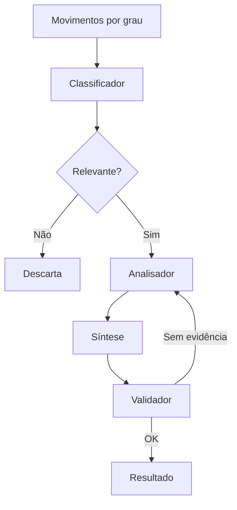

# Teste Técnico — Assistente de Processos Judiciais


## Contexto e objetivo

Você vai construir uma aplicação web que consulta processos judiciais reais através da API Pública do DataJud, disponibilizada pelo Conselho Nacional de Justiça (CNJ), e utiliza um modelo de linguagem para analisar as movimentações processuais.

Existe uma regra central neste desafio:

> **Toda afirmação produzida pela IA precisa apontar para o movimento que a sustenta.**

O problema é real. Um escritório com milhares de processos não consegue analisar manualmente cada movimentação para descobrir o que mudou.

Ao mesmo tempo, uma IA que "acha" que houve sentença, trânsito em julgado ou arquivamento quando isso não está nos dados pode induzir uma pessoa a tomar uma decisão incorreta.

O objetivo deste teste é avaliar sua capacidade de construir uma solução de **IA aplicada, auditável e confiável**, na qual um advogado consiga verificar de onde cada conclusão foi obtida.

Não é necessário conhecimento jurídico prévio. Todas as informações necessárias para compreender o domínio estão neste documento, principalmente no anexo final.

### Perfil avaliado

O desafio foi elaborado para avaliar um desenvolvedor pleno ou um desenvolvedor júnior avançado com experiência prévia em aplicações com LLMs.

### Esforço esperado

O escopo obrigatório foi dimensionado para aproximadamente **8 horas de desenvolvimento**.

Os bônus são opcionais e servem para diferenciar entregas que forem além do mínimo solicitado.

### Prazo

**7 dias corridos** a partir do recebimento deste documento.

---

# 1. Escopo obrigatório

Toda entrega deve possuir os sete itens abaixo.

Uma entrega incompleta no escopo obrigatório não será compensada simplesmente pela implementação de funcionalidades bônus.

## 1.1 Busca por número CNJ

A aplicação deve possuir uma tela onde o usuário possa informar o número de um processo.

Deve aceitar tanto:

```text
5017676-30.2024.8.24.0020
```

quanto:

```text
50176763020248240020
```

O backend deverá:

* remover a máscara;
* normalizar o número para 20 dígitos;
* validar o dígito verificador utilizando módulo 97;
* somente realizar a consulta ao DataJud depois da validação.

Uma entrada inválida deve ser rejeitada sem realizar uma chamada desnecessária à API externa.

---

## 1.2 Consulta ao DataJud

O backend deverá consultar a API Pública do DataJud.

Exemplo:

```bash
curl -X POST \
  "https://api-publica.datajud.cnj.jus.br/api_publica_tjsc/_search" \
  -H "Authorization: APIKey SUA_CHAVE" \
  -H "Content-Type: application/json" \
  -d '{
    "query": {
      "match": {
        "numeroProcesso": "50176763020248240020"
      }
    }
  }'
```

A aplicação deve tratar corretamente:

* processo inexistente;
* resposta vazia;
* múltiplos documentos para o mesmo número;
* timeout;
* erro 401;
* erro 429;
* erros 5xx;
* indisponibilidade da API;
* respostas inesperadas ou inválidas.

O frontend não deve chamar o DataJud diretamente.

O fluxo deve ser:

```text
Frontend
   ↓
Backend
   ↓
DataJud
```

---

## 1.3 Persistência no PostgreSQL

Os dados consultados devem ser persistidos.

É obrigatório armazenar:

* payload bruto retornado pelo DataJud;
* processo;
* movimentações utilizadas pela aplicação;
* análise gerada pela IA.

O payload bruto é importante porque a análise da IA é derivada dos dados do tribunal. O sistema deve conseguir reprocessar uma análise sem necessariamente consultar novamente a API externa.

Uma segunda consulta ao mesmo processo não deve chamar novamente o DataJud e o LLM sem necessidade.

Você deverá definir e justificar sua política de cache no README.

Não é necessário seguir uma modelagem específica. A estrutura das tabelas, ORM e estratégia de persistência ficam a seu critério.

---

## 1.4 Análise obrigatória por LLM

A utilização de um modelo de linguagem é **obrigatória**.

Você poderá utilizar, por exemplo:

* Gemini / Vertex AI;
* OpenAI;
* Anthropic;
* Groq;
* modelo local;
* outro provedor equivalente.

Não é permitido simular IA utilizando apenas regras determinísticas e apresentar isso como análise por LLM.

A IA deverá analisar as movimentações e produzir uma resposta estruturada.

Porém, existe uma regra fundamental:

> **A IA não pode afirmar algo que não possa ser sustentado pelos dados fornecidos.**

Quando não houver informação suficiente para responder, a aplicação deverá informar explicitamente:

```text
Não é possível determinar com os dados disponíveis.
```

Essa é uma resposta válida e será considerada positivamente.

---

## 1.5 Toda conclusão precisa possuir evidência

A IA não deve simplesmente responder:

```text
O processo está em fase de cumprimento de sentença.
```

A resposta deverá indicar que essa é uma possibilidade e mostrar os movimentos que sustentam a conclusão.

Exemplo:

```text
A análise indica possível fase de cumprimento de sentença.

Evidências:
- 10/07/2026 — Extinção da execução ou do cumprimento da sentença
- 21/08/2026 — Trânsito em julgado
```

Cada evidência deve apontar para um movimento real existente no payload do processo.

A aplicação deverá conseguir demonstrar ao usuário exatamente quais movimentos foram utilizados pela IA.

---

## 1.6 Tela de resultado

A aplicação deverá apresentar, de maneira clara:

* número do processo;
* tribunal;
* grau;
* classe;
* órgão julgador;
* data de ajuizamento;
* última remessa disponível no DataJud;
* resumo produzido pela IA;
* situação possível;
* eventos relevantes;
* possível próxima etapa;
* confiança da análise;
* evidências utilizadas.

O usuário deve conseguir clicar ou interagir com as evidências para visualizar os movimentos correspondentes.

A origem da informação precisa ser auditável.

---

## 1.7 Docker Compose

A aplicação deve ser executável através de:

```bash
docker compose up
```

O ambiente deve subir, no mínimo:

```text
frontend
backend
postgres
```

O avaliador não deverá precisar instalar manualmente dependências para executar a aplicação.

---

# 2. Bônus

Os itens abaixo são opcionais.

Faça apenas aquilo que conseguir implementar adequadamente.

No README, informe claramente quais bônus foram implementados e quais foram deixados de fora.

> Deixar uma funcionalidade conscientemente de fora é melhor do que entregar várias funcionalidades incompletas.

## 2.1 Orquestração com LangGraph

Implementar o fluxo de análise utilizando LangGraph.

Esperamos algo próximo de:



O ponto mais importante não é simplesmente utilizar LangGraph.

O fluxo deve possuir um mecanismo de validação que impeça a IA de produzir conclusões sem evidências válidas.

Se uma referência não existir no payload original, o resultado deve ser rejeitado e reprocessado.

---

## 2.2 Pergunta livre sobre o processo

Adicionar uma área onde o usuário possa fazer perguntas sobre o processo.

Exemplos:

```text
O processo já teve sentença?

Houve trânsito em julgado?

Qual foi a última movimentação relevante?

Quais foram os principais eventos?

O processo possui informação sobre valor da causa?
```

A resposta deve utilizar exclusivamente os dados daquele processo.

As respostas também devem indicar os movimentos utilizados como evidência.

Se a informação não estiver disponível:

```text
Não é possível determinar com os dados disponíveis.
```

Por exemplo, o DataJud não fornece partes, CPF, OAB, valor da causa ou o conteúdo integral da sentença.

A IA não deve inventar essas informações.

---

## 2.3 Testes automatizados

Criar testes para, pelo menos:

* normalização do número CNJ;
* validação do dígito verificador;
* parser da resposta do DataJud;
* tratamento de múltiplos documentos;
* validação das referências de evidência;
* resposta vazia;
* API DataJud mockada.

---

## 2.4 Segunda rota de busca

Implementar uma segunda forma de pesquisa:

```text
GET /processos
```

permitindo listar processos por:

* classe;
* órgão julgador;
* grau.

A listagem deve possuir paginação adequada.

Como diferencial, pode utilizar `search_after` para paginação no Elasticsearch do DataJud.

---

## 2.5 Observabilidade do LLM

Registrar informações como:

* modelo utilizado;
* latência;
* quantidade de tokens;
* custo estimado;
* prompt;
* resposta bruta;
* erros;
* quantidade de tentativas.

As informações sensíveis devem ser tratadas adequadamente.

---

## 2.6 Derivação automática do tribunal

Em vez de fixar:

```text
api_publica_tjsc
```

o sistema pode descobrir o índice correspondente a partir do número CNJ.

Por exemplo:

```text
8.24
```

corresponde à Justiça Estadual de Santa Catarina.

Já:

```text
4.04
```

corresponde à Justiça Federal da 4ª Região.

O caso F foi incluído especificamente para avaliar esse comportamento.

---

# 3. Stack

A stack abaixo é obrigatória nos itens principais.

| Camada       | Obrigatório              | Livre                                                  |
| ------------ | ------------------------ | ------------------------------------------------------ |
| Backend      | Python + FastAPI         | ORM, arquitetura, gerenciador de pacotes               |
| Frontend     | Next.js + TypeScript     | App Router / Pages Router, UI, gerenciamento de estado |
| Banco        | PostgreSQL               | ORM, modelagem, migrations                             |
| LLM          | Modelo de linguagem real | Gemini, OpenAI, Anthropic, Groq, local etc.            |
| Orquestração | IA obrigatória           | LangGraph preferencialmente; LangChain aceito          |
| Infra        | Docker Compose           | Imagens base, multi-stage etc.                         |

Não é necessário utilizar GCP para este desafio.

Também não é necessário implementar:

* autenticação;
* multi-tenancy;
* CI/CD;
* Kubernetes;
* deploy em nuvem;
* design elaborado.

Uma aplicação funcional, organizada e legível é suficiente.

Caso você não possua crédito em nenhum provedor de LLM, informe antes de iniciar. Uma chave poderá ser disponibilizada.

---

# 4. Processos de teste

Os sete processos abaixo devem ser utilizados para validar a aplicação.

Todos foram conferidos no DataJud em **22/09/2026**.

Cada caso foi escolhido para testar um comportamento específico.

| Caso | Número CNJ                  | Origem       | Docs | Movs | Situação                                                                                                                       |
| ---- | --------------------------- | ------------ | ---: | ---: | ------------------------------------------------------------------------------------------------------------------------------ |
| A    | `5017676-30.2024.8.24.0020` | TJSC G1 e G2 |    2 |  143 | Sentença de procedência em parte em 12/05/2026 no 1º grau; apelação provida por acórdão em 10/09/2026 no 2º grau; sem trânsito |
| B    | `5014976-81.2024.8.24.0020` | TJSC G1      |    1 |  165 | Improcedência em 19/06/2026, trânsito em julgado em 15/09/2026                                                                 |
| C    | `5007345-58.2026.8.24.0039` | TJSC G1      |    1 |   54 | Procedência em parte em 15/09/2026, sem trânsito                                                                               |
| D    | `5008457-22.2026.8.24.0020` | TJSC G1      |    1 |   47 | Cumprimento de sentença: extinção da execução em 10/07/2026, trânsito em 21/08/2026, baixa definitiva em 17/09/2026            |
| E    | `5050734-16.2026.8.24.0000` | TJSC G2      |    1 |   40 | Agravo de instrumento não provido em 11/08/2026, trânsito em julgado do agravo em 10/09/2026                                   |
| F    | `5017085-67.2026.4.04.7108` | TRF4 JE      |    1 |   12 | Distribuído em 31/08/2026, baixa definitiva em 14/09/2026, sem nenhum julgamento                                               |
| G    | `9999999-96.2024.8.24.0020` | —            |    0 |    — | Não existe                                                                                                                     |

## Caso A

```text
5017676-30.2024.8.24.0020
```

Possui dois documentos, um referente ao primeiro grau e outro ao segundo grau.

Existem 143 movimentações no total.

A situação real inclui:

* sentença de procedência em parte em 12/05/2026 no primeiro grau;
* apelação provida por acórdão em 10/09/2026 no segundo grau;
* ausência de trânsito em julgado.

Este é o principal teste para múltiplos documentos.

O sistema não pode simplesmente utilizar:

```text
hits.hits[0]
```

como se aquele resultado representasse todo o processo.

Os movimentos dos diferentes graus devem ser considerados conjuntamente, preservando a informação sobre a origem de cada movimento.

---

## Caso B

```text
5014976-81.2024.8.24.0020
```

Possui uma decisão de improcedência em 19/06/2026 e trânsito em julgado em 15/09/2026.

Este é o caminho feliz.

A aplicação deve conseguir identificar que houve sentença e trânsito em julgado.

Porém:

> Ter sentença não significa que a parte ganhou.

A IA deve diferenciar o resultado da decisão.

---

## Caso C

```text
5007345-58.2026.8.24.0039
```

Possui procedência em parte em 15/09/2026 e não possui trânsito em julgado.

O sistema não pode concluir que o processo foi encerrado apenas porque houve sentença.

---

## Caso D

```text
5008457-22.2026.8.24.0020
```

Trata-se de cumprimento de sentença.

Possui:

* extinção da execução em 10/07/2026;
* trânsito em julgado em 21/08/2026;
* baixa definitiva em 17/09/2026.

Este caso representa um ciclo completo de execução.

A classe processual também deve ser considerada pela análise.

---

## Caso E

```text
5050734-16.2026.8.24.0000
```

É um agravo de instrumento.

Possui:

* agravo não provido em 11/08/2026;
* trânsito em julgado do agravo em 10/09/2026.

Existe uma armadilha importante:

> O que transitou em julgado foi o recurso, não necessariamente o processo principal.

A aplicação não deve concluir automaticamente que a ação principal foi encerrada.

---

## Caso F - Rio Grande do Sul (JFRS)

```text
5017085-67.2026.4.04.7108
```

É um processo da Justiça Federal da 4ª Região.

Possui:

* distribuição em 31/08/2026;
* baixa definitiva em 14/09/2026;
* nenhum julgamento.

Este caso existe para testar duas coisas:

1. Baixa definitiva não significa que houve sentença, mas necesseriamente mas houve uma decisão que encerrou o processo.
2. O índice do DataJud não é o TJSC/TJRS.

O sistema não deve afirmar que houve sentença simplesmente porque existe uma baixa definitiva.

---

## Caso G

```text
9999999-96.2024.8.24.0020
```

O número possui dígito verificador válido, mas o processo não existe no DataJud.

A aplicação deve apresentar algo como:

```text
Processo não encontrado.
```

Não deve retornar:

```text
500 Internal Server Error
```

e não deve gerar uma análise inventada pela IA.

---

# 5. Regras da IA

Esta parte representa **25% da avaliação**.

A IA não pode afirmar o que não estiver sustentado pelos movimentos disponíveis.

Quando não houver informação suficiente, deve retornar explicitamente que não é possível determinar.

## 5.1 Contrato de saída

A análise deverá seguir uma estrutura equivalente a:

```json
{
  "resumo": "string",
  "situacao_possivel": "string | null",
  "eventos_relevantes": [
    {
      "data": "YYYY-MM-DD",
      "evento": "string",
      "tipo": "SENTENCA | ACORDAO | DESPACHO | PETICAO | AUDIENCIA | INTIMACAO | CITACAO | RECURSO | PAGAMENTO | ARQUIVAMENTO | OUTROS",
      "importancia": "alta | media | baixa",
      "movimento_ref": {
        "grau": "G1",
        "indice": 27,
        "codigo": 221
      }
    }
  ],
  "possivel_proxima_etapa": "string | null",
  "confianca": 0.0,
  "nao_determinado": [
    "string"
  ]
}
```

## 5.2 Validação das evidências

Todo:

```text
movimento_ref
```

deve apontar para um movimento que realmente existe no payload original.

Uma referência inventada invalida o item correspondente.

Nenhuma data dos eventos relevantes pode:

* ser posterior ao último movimento recebido;
* ser anterior à distribuição do processo.

Os campos:

```text
situacao_possivel
possivel_proxima_etapa
```

devem aceitar:

```text
null
```

Se a IA sempre preencher esses campos, existe risco de ela estar inventando informação.

O campo:

```text
nao_determinado
```

deve informar aquilo que não pode ser respondido com os dados disponíveis.

---

## 5.3 Confiança

Não peça simplesmente para o LLM informar:

```text
"confianca": 0.87
```

LLMs não são calibrados dessa maneira.

A confiança deve ser calculada por critérios controlados pela aplicação.

Você pode considerar, por exemplo:

* quantidade de evidências;
* proximidade temporal;
* códigos dos movimentos;
* consistência entre graus;
* existência de movimentos contraditórios;
* qualidade das evidências utilizadas.

Explique no README qual fórmula ou critério foi utilizado.

---

# 6. Classificação determinística

Existe uma decisão de arquitetura importante neste desafio.

Os movimentos do DataJud possuem códigos da Tabela Processual Unificada do CNJ.

Portanto, quando o código já determina claramente o significado do movimento, não há motivo para utilizar um LLM.

Por exemplo:

```text
220 → Improcedência
221 → Procedência em Parte
237 → Provimento
239 → Não-Provimento
196 → Extinção da execução ou do cumprimento da sentença
848 → Trânsito em julgado
22  → Baixa Definitiva
```

Essas classificações podem e devem ser feitas deterministicamente.

Por exemplo:

```python
MOVEMENT_TYPES = {
    220: "IMPROCEDENCIA",
    221: "PROCEDENCIA_EM_PARTE",
    237: "PROVIMENTO",
    239: "NAO_PROVIMENTO",
    196: "EXTINCAO_EXECUCAO",
    848: "TRANSITO_EM_JULGADO",
    22: "BAIXA_DEFINITIVA",
}
```

O LLM deve entrar onde existe ambiguidade real.

Exemplos:

```text
12164 — Outras Decisões
581 — Documento
```

Nesse último caso, o conteúdo de:

```text
complementosTabelados
```

pode fornecer informações adicionais, como:

```text
tipo_de_documento: Acórdão
```

O LLM também pode ser utilizado para interpretar a história como um todo:

* resumo;
* situação possível;
* próxima etapa;
* relação entre diferentes movimentos;
* interpretação de informações ambíguas.

Não é necessário mandar todas as movimentações para o LLM.

Uma aplicação que simplesmente envia 165 movimentos para o modelo e pede:

> "Classifique tudo"

provavelmente terá custo maior, maior latência e maior chance de erro.

A separação entre regras determinísticas e LLM faz parte da avaliação.

---

# 7. Integração com o DataJud

A API Pública do DataJud é disponibilizada pelo CNJ.

Documentação:

https://datajud-wiki.cnj.jus.br/api-publica/

Acesso:

https://datajud-wiki.cnj.jus.br/api-publica/acesso/

Endpoints:

https://datajud-wiki.cnj.jus.br/api-publica/endpoints/

Exemplo de consulta:

```bash
curl -X POST \
  "https://api-publica.datajud.cnj.jus.br/api_publica_tjsc/_search" \
  -H "Authorization: APIKey SUA_CHAVE" \
  -H "Content-Type: application/json" \
  -d '{
    "query": {
      "match": {
        "numeroProcesso": "50176763020248240020"
      }
    }
  }'
```

## 7.1 Normalização

A API utiliza os 20 dígitos do número CNJ.

A interface pode aceitar:

```text
5017676-30.2024.8.24.0020
```

mas o backend deve transformar em:

```text
50176763020248240020
```

antes da consulta.

O dígito verificador deve ser validado utilizando módulo 97.

---

## 7.2 Múltiplos documentos

Um processo pode retornar mais de um documento.

Isso pode acontecer, por exemplo, quando existem informações referentes a diferentes graus.

O sistema deve:

1. recuperar todos os documentos relevantes;
2. juntar os movimentos;
3. preservar o grau de cada movimento;
4. ordenar a timeline;
5. apresentar essa informação ao usuário;
6. permitir que a IA utilize todas as evidências relevantes.

---

## 7.3 Sigilo

Se:

```text
nivelSigilo > 0
```

a aplicação não deve analisar nem exibir o conteúdo protegido.

Deve informar ao usuário que o processo corre em segredo de justiça.

---

## 7.4 Erros

Os seguintes cenários devem possuir comportamentos distintos:

```text
401 → erro de autenticação
429 → limite de requisições
5xx → indisponibilidade do DataJud
timeout → serviço externo indisponível
0 resultados → processo não encontrado
```

Não transforme todos os cenários em:

```text
Erro interno
```

---

## 7.5 Payload bruto

O payload bruto do DataJud deve ser armazenado.

A análise da IA é uma interpretação derivada.

Os dados do tribunal são a fonte original.

Isso permite:

* auditoria;
* reprocessamento;
* criação de novos analisadores;
* comparação entre versões do prompt;
* recuperação após alterações no modelo.

---

## 7.6 Data da última remessa

O DataJud não representa necessariamente o andamento em tempo real do processo.

Os dados refletem a última carga/remessa realizada pelo tribunal ao CNJ.

A interface deve deixar isso claro.

Não apresente a informação como se fosse necessariamente uma consulta em tempo real ao processo.

---

# 8. Segurança e configuração

Nenhuma credencial deve chegar ao navegador.

O fluxo correto é:

```text
Frontend
   ↓
Backend
   ↓
DataJud
LLM
```

As chaves devem permanecer exclusivamente no backend.

Utilize variáveis de ambiente.

O repositório deve possuir:

```text
.env.example
```

sem valores reais.

Exemplo:

```env
DATAJUD_API_KEY=
LLM_API_KEY=
DATABASE_URL=
```

Não utilize:

```text
NEXT_PUBLIC_
```

para credenciais ou chaves de API.

Variáveis com esse prefixo podem ser disponibilizadas no bundle do cliente.

Também verificaremos o histórico do Git.

Uma chave que foi commitada e posteriormente removida continua disponível no histórico.

---

# 9. Entregáveis

Entregue um repositório Git público ou privado com acesso liberado para a equipe.

O repositório deve conter:

```text
backend/
frontend/
docker-compose.yml
.env.example
README.md
```

A estrutura pode ser diferente, desde que esteja organizada.

O README da sua implementação deverá responder de maneira curta e direta:

### 1. Como executar

Explique do zero até a primeira consulta funcionando.

### 2. Arquitetura

Explique:

* o que cada serviço faz;
* como frontend e backend conversam;
* como backend, PostgreSQL, DataJud e LLM se relacionam.

### 3. Decisões técnicas

Explique:

* decisões de arquitetura;
* modelagem;
* cache;
* tratamento de erros;
* o que ficou de fora por falta de tempo.

### 4. IA

Explique:

* qual modelo foi utilizado;
* qual provedor;
* como o prompt foi estruturado;
* quais partes utilizam LLM;
* quais partes são regras determinísticas;
* como as evidências são geradas.

### 5. Alucinação

Explique:

* como as evidências são validadas;
* o que acontece quando o modelo retorna JSON inválido;
* o que acontece quando uma evidência não existe;
* como o sistema evita conclusões sem suporte.

### 6. DataJud

Explique:

* como os erros são tratados;
* como múltiplos documentos são tratados;
* como o cache funciona;
* como sigilo é tratado;
* quais limitações da API foram consideradas.

### 7. Escalabilidade

Imagine que o escritório precise monitorar:

```text
100.000 processos
```

diariamente.

Não queremos um diagrama gigante de microsserviços.

Queremos que você identifique os gargalos reais, como:

* custo do LLM;
* limite de requisições do DataJud;
* quantidade de processos;
* processos que não sofreram alteração;
* processamento desnecessário;
* concorrência;
* filas;
* cache;
* reprocessamento;
* armazenamento.

Explique como você faria essa evolução.

---

# 10. Uso de IA durante o desenvolvimento

Você pode utilizar ferramentas de IA para desenvolver o projeto.

Isso inclui:

* ChatGPT;
* Claude;
* GitHub Copilot;
* Cursor;
* Claude Code;
* Gemini;
* outras ferramentas.

Não estamos avaliando sua capacidade de escrever cada linha de código manualmente.

Durante a conversa técnica, porém, vamos abrir o repositório e perguntar sobre decisões específicas do projeto.

Você deverá conseguir explicar:

* por que determinada arquitetura foi escolhida;
* por que determinada biblioteca foi utilizada;
* como a IA funciona;
* como as evidências são validadas;
* onde estão as regras de negócio;
* como o sistema trataria um cenário diferente.

Código que você não consegue explicar conta negativamente na avaliação, independentemente de quem ou do que o escreveu.

---

# 11. Avaliação

A avaliação principal será feita sobre a implementação obrigatória.

| Critério                            | Peso |
| ----------------------------------- | ---: |
| IA aplicada                         |  30% |
| Integração DataJud                  |  25% |
| Backend                             |  15% |
| Frontend                            |  10% |
| Engenharia                          |  10% |
| Qualidade da solução e documentação |  10% |

## IA aplicada — 30%

Uma entrega forte:

* não inventa evidências;
* referencia corretamente os movimentos nos sete casos;
* sabe responder "não é possível determinar";
* diferencia sentença, acórdão, trânsito, baixa e outras situações;
* considera múltiplos graus;
* separa regras determinísticas de interpretação por LLM.

## Integração DataJud — 25%

Uma entrega forte:

* normaliza e valida o número CNJ;
* trata múltiplos documentos;
* une corretamente movimentos de diferentes graus;
* respeita sigilo;
* trata erros;
* persiste o payload bruto;
* implementa cache;
* deixa clara a limitação de atualização da base.

## Backend — 15%

Uma entrega forte possui:

* camadas bem separadas;
* validação;
* Pydantic;
* regras de negócio fora dos controllers;
* tratamento consistente de exceções;
* código legível.

## Frontend — 10%

Uma entrega forte possui:

* estados de loading;
* estado de erro;
* estado vazio;
* resultado legível;
* evidências acessíveis;
* timeline clara.

## Engenharia — 10%

Uma entrega forte possui:

```bash
docker compose up
```

funcionando de primeira, além de:

* Git organizado;
* `.env.example`;
* migrations;
* testes quando aplicável;
* README objetivo.

## Qualidade e documentação — 10%

Serão considerados:

* clareza;
* decisões técnicas;
* organização;
* tratamento de edge cases;
* documentação;
* capacidade de explicar as escolhas feitas.

---

# 12. Conversa técnica

Após a entrega, será realizada uma conversa técnica de aproximadamente **45 minutos**.

O código será aberto durante a conversa.

Não será uma prova de algoritmos.

Vamos discutir decisões reais tomadas durante o desenvolvimento.

Também poderá ser solicitada uma pequena alteração ao vivo.

Exemplos:

```text
"Agora permita que o usuário veja somente as evidências de alta importância."

"Como você alteraria isso para suportar outro tribunal?"

"Como impediria que a IA referencie um movimento inexistente?"

"Como reduziria o custo para 100.000 processos?"

"Como você testaria esse cenário?"
```

O objetivo é entender como você pensa e como trabalha sobre uma base de código existente.

---

# 13. Prazo e entrega

O prazo é de:

**7 dias corridos a partir do recebimento deste documento.**

Envie o link do repositório para:

**[gabriel@escritorioborgesadv.com.br](mailto:gabriel@escritorioborgesadv.com.br)**

Se houver algum bloqueio técnico — por exemplo, problema com chave do LLM, limite da API ou comportamento inesperado do DataJud — pergunte.

Perguntar não desconta nota.

Entregar uma implementação quebrada sem comunicar o problema, sim.

---

# 14. O que você precisa saber sobre o DataJud

A API Pública do DataJud fornece metadados processuais e movimentações.

Ela não fornece, neste contexto, informações como:

* partes;
* advogados;
* OAB;
* CPF;
* valor da causa;
* texto integral da sentença.

Os principais dados incluem informações como:

```text
numeroProcesso
tribunal
grau
classe
assuntos
orgaoJulgador
dataAjuizamento
nivelSigilo
sistema
movimentos
```

Portanto, perguntas sobre partes, valores ou conteúdo integral de decisões podem ser impossíveis de responder com os dados disponíveis.

A IA deve reconhecer essa limitação.

---

# 15. Códigos importantes

Alguns códigos da Tabela Processual Unificada são especialmente relevantes para este desafio:

| Código | Nome                                               | Significado                                       |
| -----: | -------------------------------------------------- | ------------------------------------------------- |
|     26 | Distribuição                                       | Início do processo naquele grau                   |
|    220 | Improcedência                                      | Sentença contra o autor                           |
|    221 | Procedência em Parte                               | Sentença parcialmente favorável                   |
|    237 | Provimento                                         | Decisão/acórdão que dá razão ao recorrente        |
|    239 | Não-Provimento                                     | Decisão/acórdão que nega o recurso                |
|    196 | Extinção da execução ou do cumprimento da sentença | Fim da fase de execução                           |
|    848 | Trânsito em julgado                                | Decisão se tornou definitiva                      |
|     22 | Baixa Definitiva                                   | Arquivamento definitivo                           |
|  12164 | Outras Decisões                                    | Código genérico                                   |
|    581 | Documento                                          | O tipo real pode estar em `complementosTabelados` |

Existem ainda códigos relacionados a:

* conclusão;
* petição;
* publicação;
* decurso de prazo;
* disponibilização no DJe;
* ato ordinatório;
* remessa.

Esses movimentos são frequentemente administrativos e nem sempre representam uma mudança relevante no estado do processo.

---

# 16. Complementos tabelados

Não analise somente o nome do movimento.

O campo:

```text
complementosTabelados
```

pode conter informações importantes.

Por exemplo:

```text
581 — Documento
```

pode possuir:

```text
tipo_de_documento: Acórdão
```

Da mesma forma, um movimento de conclusão pode possuir informações indicando:

```text
para julgamento
```

ou:

```text
para despacho
```

Ignorar os complementos pode fazer com que informações relevantes sejam perdidas.

---

# 17. Considerações importantes

### A base não é necessariamente em tempo real

O DataJud reflete a última remessa realizada pelo tribunal ao CNJ.

Portanto:

> A ausência de uma movimentação no DataJud não prova que aquele ato não ocorreu no processo.

A IA deve diferenciar:

```text
"não existe"
```

de:

```text
"não foi possível determinar com os dados disponíveis"
```

---

### Trânsito em julgado de recurso não encerra necessariamente o processo principal

Um recurso possui sua própria tramitação.

Por exemplo, um agravo de instrumento pode possuir trânsito em julgado enquanto a ação principal continua em andamento.

O caso E existe especificamente para testar esse comportamento.

---

### Baixa definitiva não significa necessariamente que houve julgamento

O caso F existe para demonstrar isso.

Um processo pode possuir baixa definitiva sem que os dados disponibilizados indiquem uma sentença ou julgamento.

A IA não deve preencher lacunas com suposições.

---

### Tribunais possuem índices diferentes

Exemplos:

```text
api_publica_tjsc
api_publica_trf4
```

Os segmentos do número CNJ ajudam a identificar a Justiça e o tribunal de origem.

Por exemplo:

```text
8.24 → Justiça Estadual de Santa Catarina
4.04 → Justiça Federal da 4ª Região
```

---

# 18. Fontes

Documentação oficial do CNJ:

https://datajud-wiki.cnj.jus.br/api-publica/

Acesso à API:

https://datajud-wiki.cnj.jus.br/api-publica/acesso/

Endpoints:

https://datajud-wiki.cnj.jus.br/api-publica/endpoints/

Tutorial oficial da API Pública do DataJud:

https://www.cnj.jus.br/wp-content/uploads/2023/05/tutorial-api-publica-datajud-beta.pdf

---

# Boa sorte.

Queremos ver principalmente como você transforma dados judiciais reais em uma aplicação de IA que seja **útil, explicável e auditável**.

Não estamos procurando apenas uma aplicação que "funciona".

Estamos procurando entender como você toma decisões técnicas quando a resposta errada de uma IA pode levar uma pessoa a interpretar um processo de maneira incorreta.
